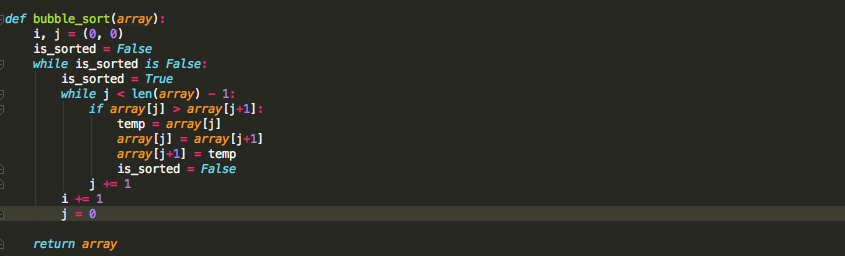
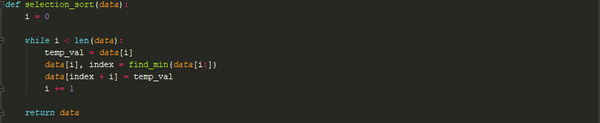
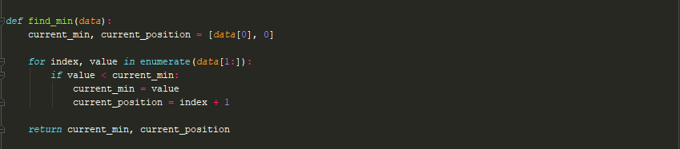
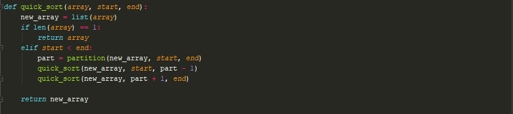
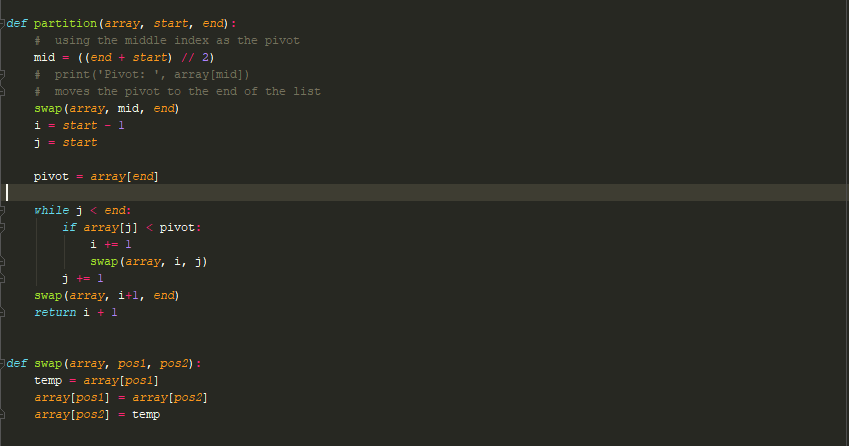

# Algorithms
## Table of Contents
- [Bubble Sort](#Bubble_Sort)
- [Insertion Sort](#Insertion_Sort)
- [Selection Sort](#Selection_Sort)
- [Merge Sort](#Merge_Sort)
- [Quick Sort](#Quick_Sort)

### Bubble Sort

Bubble sort is one of the less complicated sorting algorithms. The idea behind it is to continually loop through the 
list and swap each time an element is less then the next one in the list. In each iteration of this algorithm the 
last element swapped will be in the correct position. The version I wrote is a slightly optimized version of bubble sort.
The only difference in this that it terminates once the is list is sorted.  

For my version of bubble sort I used nested while loops.  the outer loop goes until the entire list is sorted and the 
inner loop goes through the entire list each time the list isn't sorted. In the outer loop I set a boolean to True that 
keeps track of the sorted status of the list. Inside the inner loop I check if the current index value is greater the 
value in the next index.  If this is the case then I swap those elements and set the sorted boolean to False. This 
process goes until the entire list is sorted. 

### Insertion Sort

### Selection Sort
The selection sort algorithm dictates that the list being sorted must get separated into two sections, a sorted and an 
unsorted portion. To start off there are no elements in the sorted portion of the list and the original list is the 
unsorted section. The unsorted section of the list looped through and at each step the minimum value from the unsorted 
portion is appended to the sorted portion of the list. This concept is carried out until there are no more elements left
in the unsorted portion. The run-time of this algorithm is on average O(n^2). 

This function is used to find the minimum value and its index from a list. This function initially sets the first value 
in the list as the minimum value and its index at the current index. The function loops through the remainder of the 
list, and checks if there is another value in the list that is smaller than the first value.  If there is then the the 
current min value and its index will get updated.

### Merge Sort

Merge sort is a efficient and elegant algorithm. It uses the concept of divide and conquer. By this I mean that it 
breaks down the task at hand into smaller and more manageable tasks and works it way back to the final goal.  This is 
a recursive algorithm that separates the the given list into equal portions (or as close to even as possible) until each
element is considered to be its own list. It then recombines the those lists into sorted order as it goes back up 
the recursion stack. To clarify this ordered recombination is done at each step in the recursion stack.

In this algorithm the first thing I checked for is if the list has one element. If this is the case then the list is 
already considered to be sorted and I just return the same list that was provided as the input.  

The second step in this algorithm is to separate the list into two halves and do the same thing to each half of the list
until all the elements are separated into their own list.  

The Final Step is to recombine the separated lists into sorted list at each step of the recursion stack. There are many
ways to do this step.  In my approach I created an entirely new list to wish I append the sorted data to. I loop until 
one of the lists is empty and compare the first term in each list to see which one is smaller. The list with that 
element gets that element removed and appended to the results list. At the end of the loop one of the lists must be 
empty and in that case the remaining elements of that list are already in sorted order and they get appended to the 
resulsts list.  

### Quick Sort

Quick sort uses a divide and conquer approach that is similar to that of merge sort. The major difference in this 
approach is that it uses a pivot that dictates where element of the list will end up.  All elements less than the pivot 
gets move to a position before the pivot and all elements larger than the pivot gets moved after it. This process is 
done recursively. All the elements on the left and right sides of the initial pivot gets placed through the same process
of selecting a pivot in that region and performing the same actions mentioned above.   

Here are the links I used to gain a better understanding of how the quick sort algorithm works. 

[Quicksort: Partitioning an array | By: KC Ang](https://www.youtube.com/watch?v=MZaf_9IZCrc)

[Sorts 8 Quick Sort | By: RobEdwardsSDSU](https://www.youtube.com/watch?v=ZHVk2blR45Q)

The recursive calls in quick sort are shown below. The idea behind it is that every time a partition is found the 
algorithm get ran on the elements to the left and right side of the algorithm. 

Determining what element should be the partition can be done in many ways.  Just a heads up, some of the partition 
selection methods have a greater chance of attaining the worst case performance of this algorithm. If the partition is 
always the first or last element it could lead to a O(n^2) time complexity if the list is sorted in ascending or 
descending order respectively. The average case performance is O(n log n).

The approach I took always selects the middle index of the current region of the list. I then swap the selected pivot 
with the last element in that section of the list for convenience. I then created two tracking variables i and j. The 
i variable tracks the last element smaller than the pivot and it is initially set to the position before the start of 
the list. This is because initially no items are considered to be smaller than the pivot. The j variable is used to step 
through the current portion of the list excluding the pivot.  At every point where the j index of the list has a value 
that is smaller than the pivot I increment the i variable and swap the j index value with the i index value. At the end 
of this process I swap the pivot (the last index) with the index of the first element greater than the pivot (i + 1).
The pivots location is then returned in order to continue the quick sort process.   

